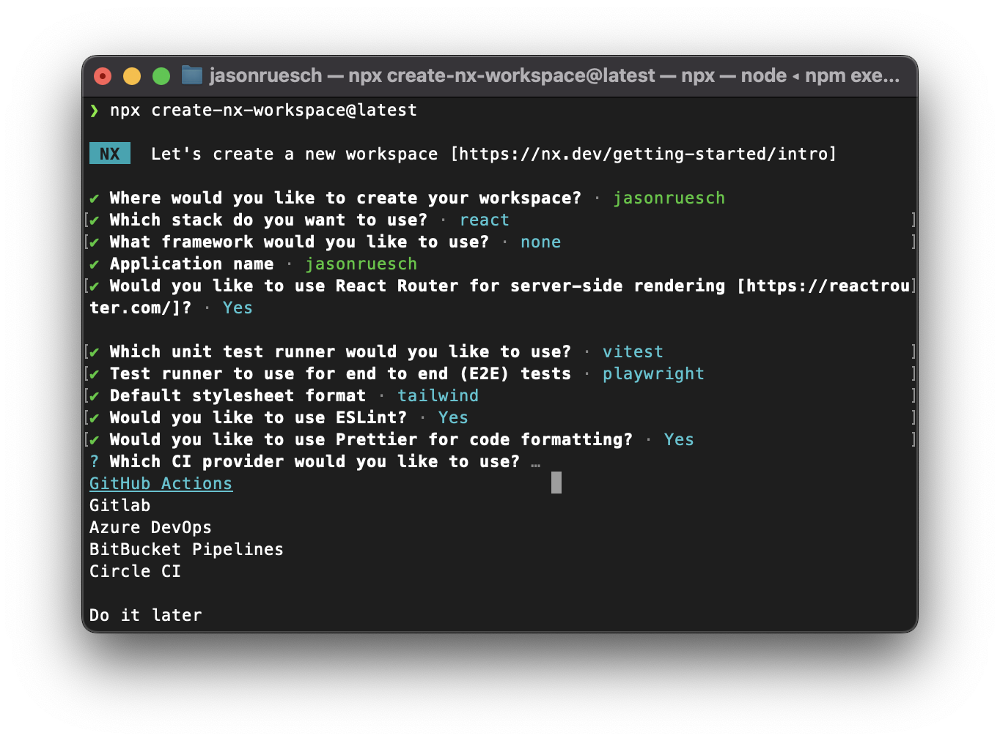

## [Nx](https://nx.dev/)

```bash
npx create-nx-workspace@latest
```

Select the following options:



Update [.github/workflows/ci.yml](../../.github/workflows/ci.yml) to temporarily disable e2e tests:

```yaml
# - run: npx playwright install --with-deps
- run: npx nx affected -t lint test build # e2e
```
